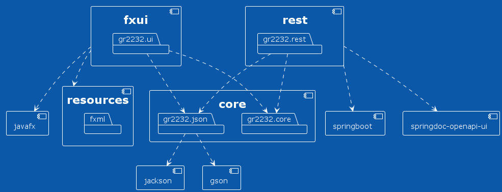
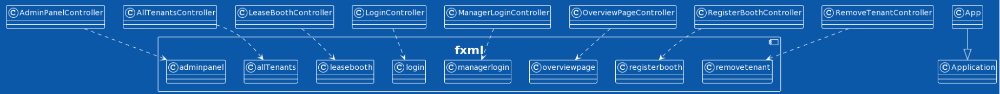

# Illustartion, build and diagrams 

The purpose of the app is to register a user's visits to rooms and see an overview of all their visits with an option to filter and delete visits at their own discretion.

## Structure and Maven build

The repository includes tests for all modules. The goal was to have a decent test coverage and having the most important functions tested. 

This projects is configured as a modularized Maven project. Each module also has an module-info.java file. The core module handles domain logic and serializing/deserializing and persistence to local storage. The fxui module handles the user interaction while the rest module handles remote storage, server and API endpoints. 

Our Maven-build requires Java version 16 or up, and JavaFX version 16.

We use various code quality tools in all modules:

- [JaCoCo Java Code Coverage Library](https://github.com/jacoco/jacoco), to check our tests' code coverage
- [Spotbugs](https://spotbugs.github.io/), to spot bugs
- [Checkstyle](https://checkstyle.sourceforge.io), standardizing our formatting to [Google coding conventions](https://github.com/checkstyle/checkstyle/blob/master/src/main/resources/google_checks.xml)

Spotbugs will stop our build if a bug is spotted. JaCoCo and Checkstyle report in .html and the console at when, for example, one executes mvn verify and mvn install.

## Diagrams

### Package Diagram

The package diagram showes the relation between packages in the repository and the modules in the packages. Where certain frameworks are used is also shown. 

The fxui module connects the UI to the code logic which is the core module. 

The rest module communicates with the core module for persistence when handling units and list of units. 

There are 3 important frameworks: Springboot, Jackson, Gson. Springboot is used for the server. Jackson is used for serializing and deserializing while Gson is used for persistence to file. Springdoc-openapi-ui follows Open-api spesification to document our Rest-api and swagger to impliment the spesification. This means that the documentation of our Rest-api can be visualized! See more info in rest module readme. 

### Class diagrams

There has been made class diagram for each package since have everthing in one class diagram would not be easy to read.

The arrows show connection between classes and for connection between classes in different packages one can look at the connections in the package diagram. 
Classdiagram: core

Classdiagram: json

Classdiagram: fxui

Classdiagram: rest

### Sequence diagram
These diagrams show what happens in a sequences after a certain interactions has occured in the application. These diagrams help with understanding what is actually happening in the background. 

Initialize() happens after employee or admin has logged-in and the application notices that the local list of units is empty. This often means it is a clean boot and therefore gets a list of units from the server. 
.png)

Shows a POST call to the server when admin adds new units.

'

This is the same interaction as above, but without the server. This happens when the user has choosen to use only local storage.

Shows a PUT call to server when the user registers a tenant to a unit. The PUT call to remove a tenant is very similar. 

