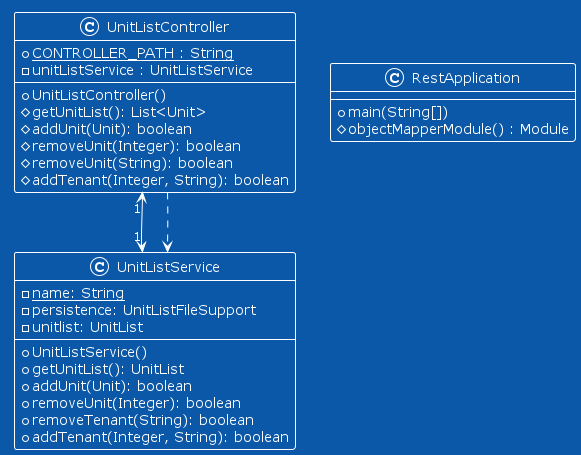

# Release 3

The major implementations of this release are as follows: 

### Rest
- REST-API
    - Created a REST-API using Spring-boot. 
    - Accepts the following paths:
        - GET http://localhost:8080/unitlist
            - Returns all units from the Server
        - POST http://localhost:8080/unitlist
            - Accepts a JSON string of a Unit. 
            - Returns statuscode:200 and "true" in responsebody if sucessfull. 
        - DELETE http://localhost:8080/unitlist/{location}
            - Deletes the Unit from the server. 
            - Returns statuscode:200 and "true" in responsebody if sucessfull. 
        - PUT http://localhost:8080/unitlist/removetenant/{location}
            - Removes the tenant from the location.
            - Returns statuscode:200 and "true" in responsebody if sucessfull. 
        - PUT http://localhost:8080/unitlist/addtenant/{location}/{tenant}
            - Adds a tenant to the given location
            - Returns statuscode:200 and "true" in responsebody if sucessfull.

    - See Swagger for complete documentation.

    - Stores Units in a serverside JSON-file. 

    - Uses this API if user specifies that they want to use REST in the application login-screen. 
### Features

- Features
    - Updated HandleUser.java
        - Now stores a static state, used to determine if user wants to use REST or just local-persistence.

        - Used in ManagerLoginPage

    - Added a managerlogin-page
        - Checks if input username and password is correct.

        - Only one user, stored in HandleUser.java

        - Correct input is 
            - Username: admin
            - Password: admin123

    - Supports use of both local persistence and REST
        - User clicks on "use REST?" checkbox upon login to determine if they want to use REST or not. 
    
    - Now supports removal of individual units.
        - Location of removed unit cannot be reused.
            - Something that we would fix in another submission. 
### Improvements

- Improvements
    - Added improved tests on exisiting and new files.
        - Testcoverage at 92% in core
        - Testcoverage at 75% in fxui
        - Testcoverage at 96% in rest
    
    - Resets Unitlist upon logout.
        - If not using REST:
            - Stores files in backup.model.json if you forgot to save. 
    

## Diagrams

ClassDiagram Core

Classdiagram FXUI

Classdiagram JSON

Classdiagram Rest

Sequence diagram AllUnits

Sequence diagram rest AddNewUnit

Sequence diagram rest Initialize

Sequence diagram rest Register Tenant

