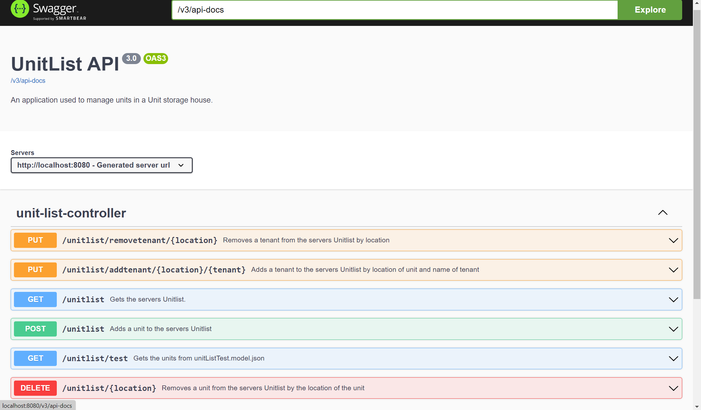

# Rest module

This module contains the REST-server and REST-API for the application. 

## Information

* **RestApplication.java** starts the spring boot server.
* **UnitListService.java** containes the REST-api and its methodes: 1. GET 2. POST 3. PUT and 4. DELETE
* **UnitListController.java** containes the logic for the methoeds used in UnitListService.java
* There are written tests for above classes

Launch the REST-server by going into the rest folder and executing the following command. 

```console
foo@bar:~/gr2232/gr2232/rest
mvn spring-boot:run
```

NOTE that the server is run on http://localhost:8080/

## Documentation of REST-api 
To document our Rest-api we used Open-api spesification and swagger to implement the spesification. 
By doing this we get a vizualation of our documentation that follows Open-api spesification and the person reading can <strong>interact</strong> with our api though the swagger-ui! There is no need to use the terminal. 

## How to interact and view REST-api documentation 

Make sure the server is online as described above. After that paste: http://localhost:8080/swagger-ui.html  into the browser and you should see something like this: 




## Maven build

In addition to the plugins used [project-wide](../README.md), we use the following plugins in the rest module to run our server and Rest-api:

- [SpringBoot](https://spring.io/projects/spring-boot) to set up a server on localhost, set up REST API endpoints and for testing these features.
- [Springdoc-openapi-ui](https://spring.io/projects/spring-boot) to document our api. Uses Open-api spesification to document Rest-api and swagger to implement the spesification. 
