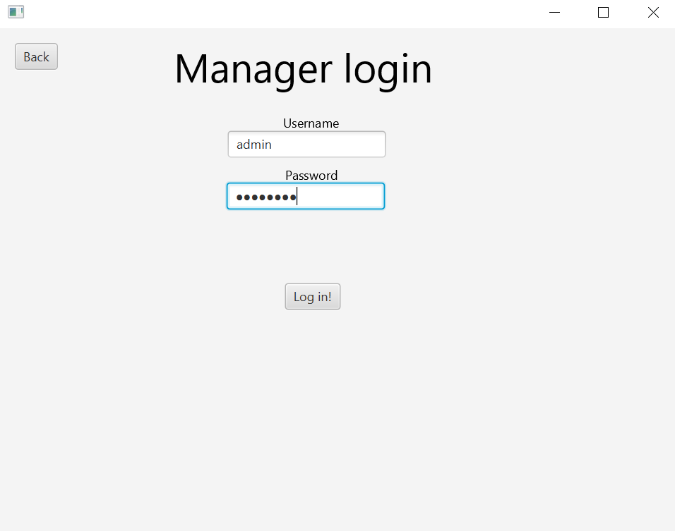

# Group gr2232 repository 

## About
This is a repository that consists of a JavaFX app. This app can be used for managing units in a unit storage house. Based on if the user is a manager or employee the user can: 
1. Add and delete units (Only Manager)
2. Add and remove a tenant from a unit. 
The user also has an overview of the units and their status: if the unit is rented, location and size. 

The application reads and stores date to JSON files. The user can choose if this happens remotely or locally. 

The files for the application are located in the [gr2232](/gr2232/) folder. In hindsight we realize this folder should have had a more appropiate name. However, we believe it is not critical. The other files in the same location as this README are files for configuration of Gitpod and [.gitgnore](.gitgnore) file for specifying untracted files Git should ignore. 
<p>&nbsp;</p>

## Getting started: 

## Gitpod 
[](https://gitpod.stud.ntnu.no/#https://gitlab.stud.idi.ntnu.no/it1901/groups-2022/gr2232/gr2232) 

To launch the project in gitpod click on the "Gitpod Ready-to-code tag". 


## Locally
To launch the project locally you first need to clone or download the repository and open it as a Maven project in an IDE of choice. We recommed Vscode. 
<p>&nbsp;</p>

## Setup:
After opening the repository in gitpod or locally: Navigate into gr2232 folder. Execute the following command in your terminal:

```console
foo@bar:~/gr2232/gr2232/
mvn install
```
Note that some tests will fail (ClosedChannelException) while running mvn install, due to requiring REST-server running. 
<p>&nbsp;</p>
Launch the REST-server by going into the rest folder and executing the following command. 

```console
foo@bar:~/gr2232/gr2232/rest
mvn spring-boot:run
```
The REST-server should now be up and running! Having the server running is needed to test the full functinality of the application. 
<p>&nbsp;</p>
Next create a new terminal instance and don't close the terminal with the rest server running! Everything should now work. Doublecheck using:

```console
foo@bar:~/gr2232/gr2232/
mvn verify
```
If the build is a success we can finally run the JavaFX application!
<p>&nbsp;</p>

## How to run the application:
The application is now ready to use. 
To run the project on your computer, navigate to the FXUI directory, and execute the following command:

```console
foo@bar:~/gr2232/gr2232/fxui
mvn javafx:run
```
To use the rest-api and server simply press the "Use Rest?" at log in. 


To log in as a manager you have to type the username: <em><strong>admin</strong></em> and the password: <em><strong>admin123</strong></em>



<strong>NOTE:</strong> If you use local storage (default). Rememeber that after adding units you can save them locally by clicking at the settings button and then naming the file and pressing save. The same thing if you want to load an file you previously had saved. 


"<em>Clear system?</em>" clears all the units you have added from the application. 

## Run tests and checks:
This project uses Spotbugs to find possible errors,bugs and vulnerabilities. Keep in mind Spotbugs will issue a Build Fail if any spotbugs are found. Project also uses Checkstyle to keep the same styling and indendation on the files. The projects also uses a test coverage plugin called jacoco. To run these plugins, execute the following command:

```console
foo@bar:~/gr2232/gr2232
mvn verify
```
## How to view test coverage?
To see the test-coverage for the repository make sure you have allready executed mvn verify or mvn test. 

Then navigate to the wished directory:
```console
foo@bar:~/gr2232/gr2232/core/target/site/jacoco

foo@bar:~/gr2232/gr2232/fxui/target/site/jacoco

foo@bar:~/gr2232/gr2232/rest/target/site/jacoco
```
And open the corresponding index.html files. Note that you have to run maven test before looking at the test-coverage.

# Further reading

TODO: Link to other readme files and short text what one can find there

Go [here](gr2232/README.md) to view illustartion, package-, sequences-, classdiagram of the application. 

Go [here](gr2232/core/README.md) to view documentation about the core module and the JSON-data files that are used

Go [here](gr2232/fxui/README.md) to view documentation about the fxui module 

Go [here](gr2232/rest/README.md) to view documentation about the rest module and the rest-api. 

Go [here](gr2232/docs/release2/workhabits.md) to read about workhabits our use of tools and reason for late submission. 

Go [here](brukerhistorier.md) to read about userstories used for developing the application. 

Go [here](gr2232/docs/release3/typeOfPersitence.md) to read about our reflection about type of persistence. 

Click [here](gr2232/docs/release3/README.md) to see documentation for the third release. 


